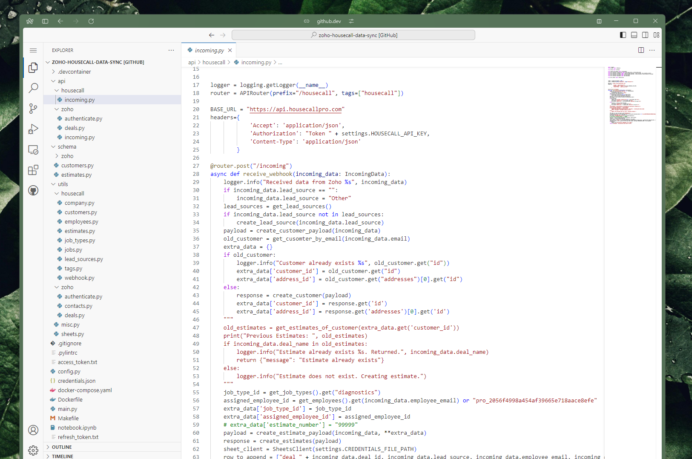
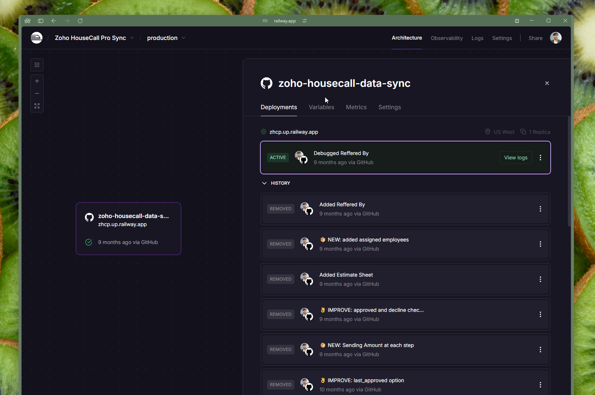

<div align="center">
<h1>Zoho HouseCall Data Sync</h1>
<h4>An automated integration system that synchronizes data between Zoho CRM and HouseCall Pro, streamlining customer, estimate, and employee management.</h4>



[](https://github.com/concaption/zoho-housecall-data-2-ways-sync)
[](https://github.com/concaption/zoho-housecall-data-2-ways-sync)
[](https://github.com/concaption/zoho-housecall-data-2-ways-sync)
</div>

## Features

- Webhook handling for both Zoho CRM and HouseCall Pro events
- Customer data synchronization
- Deal/Estimate management
- Automated lead source tracking
- Google Sheets integration for data logging
- OAuth2 authentication for Zoho CRM
- Comprehensive logging system

## Prerequisites

- Python 3.10+
- Docker (optional)
- Zoho CRM account with API access
- HouseCall Pro account with API access
- Google Sheets API credentials

## Installation

1. Clone the repository
2. Set up your virtual environment:

```bash
make setup
```

3. Install dependencies:

```bash
make install
```

4. Copy `.env.example` to `.env` and fill in your credentials:

```env
PROJECT_NAME="Data Sync"
PROJECT_VERSION="0.1.0"
HOUSECALL_API_KEY="your_housecall_api_key"
ZOHO_CLIENT_ID="your_zoho_client_id"
ZOHO_CLIENT_SECRET="your_zoho_client_secret"
ZOHO_AUTH_CODE="your_zoho_auth_code"
ZOHO_REDIRECT_URI="your_redirect_uri"
```

5. Copy `credentials.json.example` to `credentials.json` and fill in your Google Sheets API credentials

## Running the Application

### Local Development

```bash
make run
```

### Using Docker

```bash
docker-compose up
```

## Testing

Run the test suite:

```bash
make test
```

## Project Structure

- `api/` - API route handlers
- `utils/` - Utility functions for Zoho, HouseCall Pro, and Google Sheets
- `schema/` - Pydantic models for data validation
- `config.py` - Application configuration
- `main.py` - FastAPI application entry point

## API Endpoints

### Zoho CRM

- `POST /zoho/authenticate` - Authenticate with Zoho CRM
- `GET /zoho/refresh` - Refresh Zoho access token
- `POST /zoho/incoming` - Webhook endpoint for Zoho events

### HouseCall Pro

- `POST /housecall/incoming` - Webhook endpoint for HouseCall Pro events

## Development

Format code:
```bash
make format
```

Lint code:
```bash
make lint
```

Run all checks:
```bash
make all
```



## Contributing

1. Fork the repository
2. Create your feature branch (`git checkout -b feature/amazing-feature`)
3. Commit your changes (`git commit -m 'Add some amazing feature'`)
4. Push to the branch (`git push origin feature/amazing-feature`)
5. Open a Pull Request

## License

This project is licensed under the MIT License - see the LICENSE file for details.

## Acknowledgments

- FastAPI
- Zoho CRM API
- HouseCall Pro API
- Google Sheets API

<!-- Mermaid js diagrma -->

```mermaid
graph TB
    %% Title
    title[Integration Architecture] 
    style title fill:none,stroke:none
    
    subgraph Zoho CRM
        Z1[Zoho CRM Events]:::zoho click Z1 "Handles incoming events from Zoho CRM"
        Z2[Contacts]:::zoho click Z2 "Contact management in Zoho"
        Z3[Deals]:::zoho click Z3 "Deal/Estimate management in Zoho"
        Z4[OAuth2 Auth]:::zoho click Z4 "OAuth2 authentication for Zoho CRM"
    end

    subgraph HouseCall Pro
        H1[HouseCall Events]
        H2[Customers]
        H3[Estimates]
        H4[Jobs]
        H5[Lead Sources]
    end

    subgraph Integration Layer
        W1[Webhook Handler]
        S1[Data Sync Engine]
        A1[Auth Manager]
        L1[Logging System]
    end

    subgraph Storage
        G1[Google Sheets]
        T1[Token Storage]
    end

    %% Event Flow
    Z1 -->|Webhook| W1
    H1 -->|Webhook| W1
    
    %% Data Sync
    W1 -->|Process Events| S1
    S1 -->|Update| Z2
    S1 -->|Update| Z3
    S1 -->|Update| H2
    S1 -->|Update| H3
    S1 -->|Update| H4
    S1 -->|Create/Update| H5

    %% Authentication
    Z4 -->|Token| A1
    A1 -->|Store| T1
    
    %% Logging
    S1 -->|Log Events| L1
    L1 -->|Store| G1

    %% Styles
    classDef zoho fill:#ff9999
    classDef hcp fill:#99ff99
    classDef integration fill:#9999ff
    classDef storage fill:#ffff99

    class Z1,Z2,Z3,Z4 zoho
    class H1,H2,H3,H4,H5 hcp
    class W1,S1,A1,L1 integration
    class G1,T1 storage
```